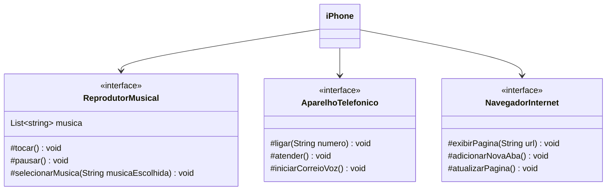

```mermaid
classDiagram
    class ReprodutorMusical {
        <<interface>>
        List~string~ musica
        #tocar()void
        #pausar()void
        #selecionarMusica(String musicaEscolhida)void
    }

    class AparelhoTelefonico {
        <<interface>>
        #ligar(String numero)void
        #atender()void
        #iniciarCorreioVoz()void
    }

    class NavegadorInternet {
        <<interface>>
        #exibirPagina(String url)void
        #adicionarNovaAba()void
        #atualizarPagina()void
    }

    class iPhone {
        
    }

    iPhone --> ReprodutorMusical
    iPhone --> AparelhoTelefonico
    iPhone --> NavegadorInternet
```
